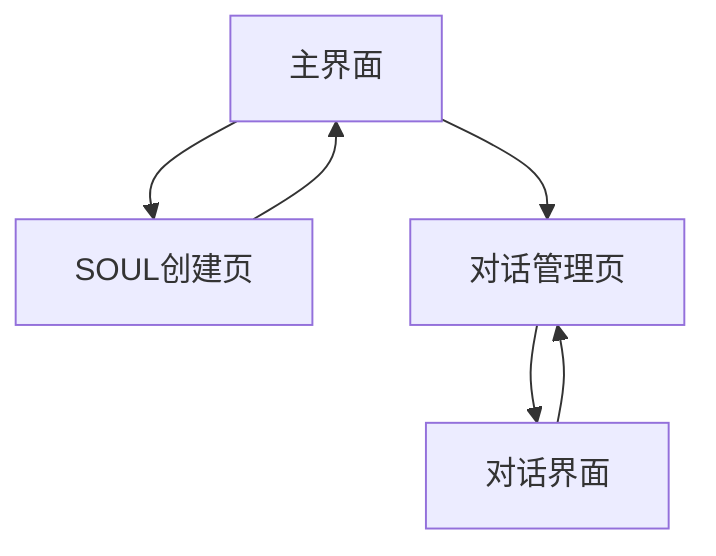

## 1. Product Overview
Distill Your Bro 是一个AI人格蒸馏与对话平台，用户可以通过上传聊天记录来创建AI人格（SOUL），并与这些人格进行对话。产品帮助用户将真实人物的聊天风格转化为AI模型，实现个性化的AI对话体验。

## 2. Core Features

### 2.1 User Roles
| Role | Registration Method | Core Permissions |
|------|---------------------|------------------|
| Normal User | 无需注册，直接使用 | 创建SOUL、管理对话Session、上传聊天记录 |

### 2.2 Feature Module
产品包含以下核心页面：
1. **主界面**: SOUL列表展示、创建新SOUL入口、导航到对话管理
2. **SOUL创建页**: 聊天记录上传、人格蒸馏参数设置、SOUL预览与保存
3. **对话管理页**: Session列表、新建对话、进入对话界面
4. **对话界面**: 实时聊天、历史消息展示、Session管理

### 2.3 Page Details
| Page Name | Module Name | Feature description |
|-----------|-------------|---------------------|
| 主界面 | SOUL列表 | 展示已创建的SOUL，显示bro名称和创建时间，支持删除和导出markdown操作 |
| 主界面 | 创建入口 | 提供跳转到SOUL创建页面的按钮 |
| 主界面 | 对话管理入口 | 提供跳转到对话管理页面的按钮 |
| SOUL创建页 | 文件上传 | 支持上传聊天记录文件（JSON或纯文本），选择聊天平台类型 |
| SOUL创建页 | 参数设置 | 设置bro名称、文本处理选项（是否仅文本、用户名标识） |
| SOUL创建页 | 蒸馏预览 | 调用蒸馏接口生成SOUL内容，展示预览结果，用户阻塞等待生成完成 |
| SOUL创建页 | 保存功能 | 确认保存SOUL到后端存储 |
| 对话管理页 | Session列表 | 展示所有对话Session，显示关联的bro名称和创建时间 |
| 对话管理页 | 新建对话 | 选择SOUL创建新对话Session |
| 对话管理页 | 删除对话 | 删除不需要的Session |
| 对话界面 | 消息展示 | 展示对话历史，区分用户消息和bro消息 |
| 对话界面 | 消息输入 | 提供文本输入框和发送按钮 |
| 对话界面 | 实时对话 | 发送消息到后端，接收并展示AI回复 |
| 对话界面 | Session控制 | 提供返回和删除Session的选项 |

## 3. Core Process
用户操作流程：
1. 用户访问主界面，查看已创建的SOUL列表
2. 点击创建SOUL，进入创建页面上传聊天记录并设置参数
3. 系统解析聊天记录，用户点击发起蒸馏后阻塞等待生成SOUL预览
4. 用户确认预览结果后保存，或选择重新解析
5. 返回主界面后，可以点击进入对话管理
6. 选择SOUL创建新对话Session，进入对话界面
7. 在对话界面与AI人格进行实时交流

## 4. User Interface Design

### 4.1 Design Style
- 主色调：深蓝色（#1e40af）和白色背景
- 按钮样式：圆角矩形，hover效果，主要操作为实心按钮，次要操作为边框按钮
- 字体：系统默认字体，标题18-24px，正文14-16px
- 布局：卡片式布局，顶部导航栏，内容区域居中显示
- 图标：使用简洁的线性图标，如+号表示创建，垃圾桶表示删除

### 4.2 Page Design Overview
| Page Name | Module Name | UI Elements |
|-----------|-------------|-------------|
| 主界面 | 导航栏 | 深蓝色背景，白色文字，包含产品名称和两个导航按钮（SOUL管理、对话管理） |
| 主界面 | SOUL卡片 | 白色卡片，圆角边框，显示bro名称和创建时间，右上角删除按钮 |
| 主界面 | 创建按钮 | 固定在右下角的圆形+号按钮，蓝色背景，白色+号 |
| SOUL创建页 | 表单区域 | 白色卡片，包含文件上传区域、文本输入框、下拉选择器等 |
| SOUL创建页 | 预览区域 | 灰色背景的代码块样式，展示生成的SOUL内容 |
| 对话管理页 | Session列表 | 类似SOUL列表的卡片布局，显示bro名称和最后对话时间 |
| 对话界面 | 消息气泡 | 用户消息右对齐蓝色气泡，bro消息左对齐灰色气泡 |
| 对话界面 | 输入区域 | 底部固定输入框，包含文本输入和发送按钮 |

### 4.3 Responsiveness
桌面优先设计，支持响应式布局：
- 桌面端：最大宽度1200px，内容居中显示
- 平板端：适配768px以上屏幕，保持基本布局
- 手机端：单列布局，导航栏变为汉堡菜单，卡片全宽显示
- 触摸优化：按钮和交互元素最小44px点击区域

### 4.4 3D Scene Guidance
不适用，本产品为纯2D界面。