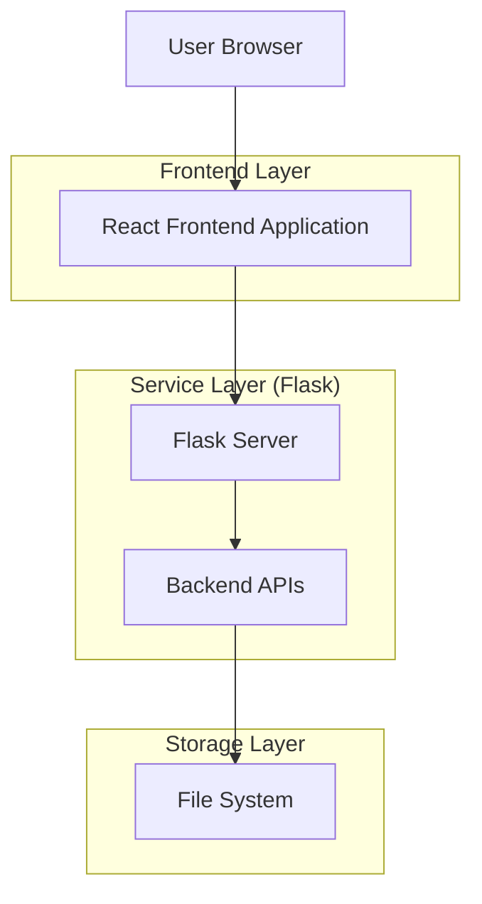
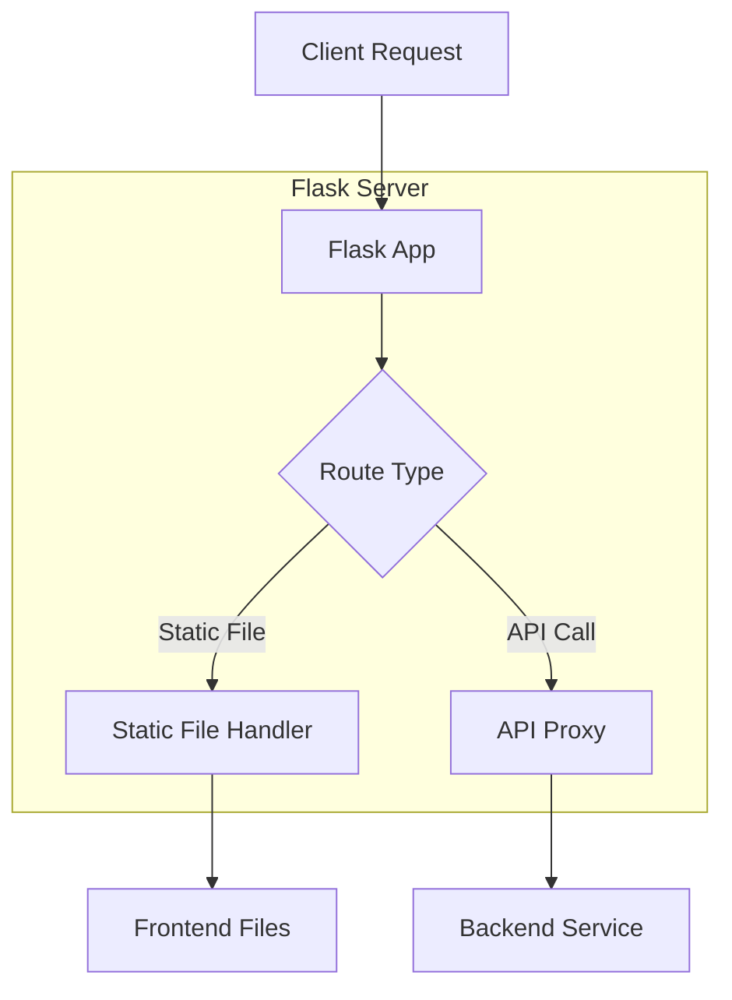

## 1. Architecture design



## 2. Technology Description
- Frontend: React@18 + tailwindcss@3 + vite
- Initialization Tool: vite-init
- Backend: Flask (提供静态文件服务和API代理)
- Server Port: 1007

## 3. Route definitions
| Route | Purpose |
|-------|---------|
| / | 主界面，显示SOUL列表和导航 |
| /souls/create | SOUL创建页面，上传聊天记录和生成SOUL |
| /sessions | 对话管理页面，管理所有对话Session |
| /sessions/:id | 对话界面，与AI人格进行实时对话 |

## 4. API definitions

### 4.1 Chat Log Parsing API
```
POST /api/chatlogs/parse
```

Request:
| Param Name | Param Type | isRequired | Description |
|------------|------------|------------|-------------|
| platform | string | true | 聊天平台类型（wechat等） |
| payload | string | true | 原始聊天记录内容 |
| options.text_only | boolean | false | 是否仅处理文本 |
| options.my_name | string | false | 用户名称标识 |

Response:
```json
{
  "ok": true,
  "data": {}
}
```

### 4.2 SOUL Distillation API
```
POST /api/souls/distill
```

Request:
| Param Name | Param Type | isRequired | Description |
|------------|------------|------------|-------------|
| bro_name | string | true | Bro名称 |

Response:
```json
{
  "ok": true,
  "data": {
    "bro_name": "张三",
    "soul_markdown": "# 角色：..."
  }
}
```

### 4.3 SOUL Management APIs
```
POST /api/souls/save - 保存SOUL
GET /api/souls - 列出所有SOUL
GET /api/souls/{bro_name} - 获取指定SOUL
DELETE /api/souls/{bro_name} - 删除指定SOUL
GET /api/souls/{bro_name}/export - 导出SOUL为markdown文件
```

### 4.4 Session Management APIs
```
POST /api/sessions - 创建新Session
GET /api/sessions - 列出所有Session
GET /api/sessions/{session_id} - 获取Session详情
POST /api/sessions/{session_id}/messages - 发送消息
DELETE /api/sessions/{session_id} - 删除Session
```

## 5. Server architecture diagram



## 6. Data model
不适用，前端不直接管理数据存储，所有数据通过API与后端交互。